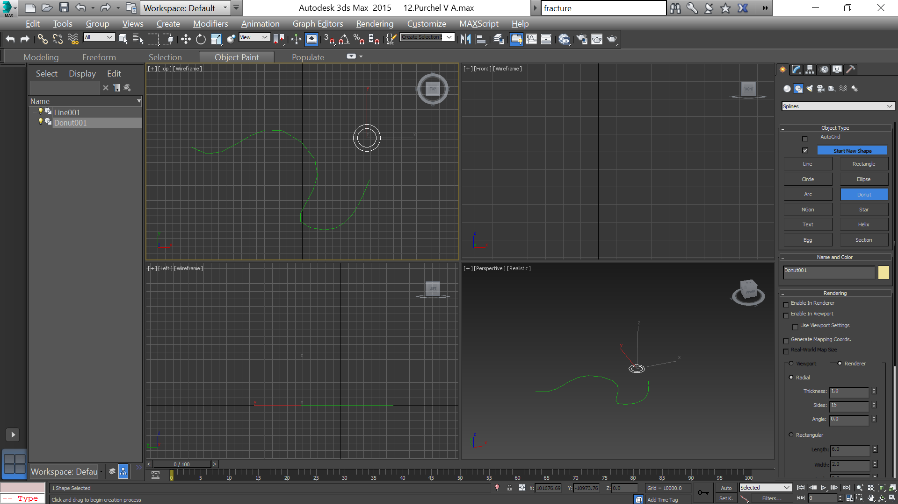

- title : Освещение сцены и эффекты
- description : Практическое задание к теме "Освещение сцены и эффекты"
- author : Василий Пурчел
- theme : night
- transition : default

***

### Освещение сцены и эффекты

[Практическое задание к теме 11](http://dl.sumdu.edu.ua/study_tools/drop/start/376674)

Выполнил : Василий Пурчел

Вариант : 6

Сцена : [13.Purchel V A.max](files/13.Purchel V A.max)

---

### Задание

Задание выглядет несколько не правильным как для темы про освещение сцены и эффекты.

С помощью модификатора Lathe создать яблоко, и с помощью объекта Loft (Опорные сечения) создать шланг.

***

### Процесс

Яблоко:

---

Линия шланга и пончик для формы сечения:

---

Используем Compound object Loft:

---

Созданный шланг:

