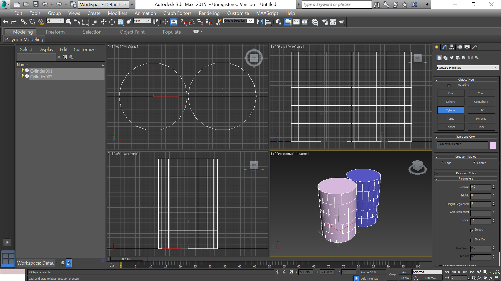
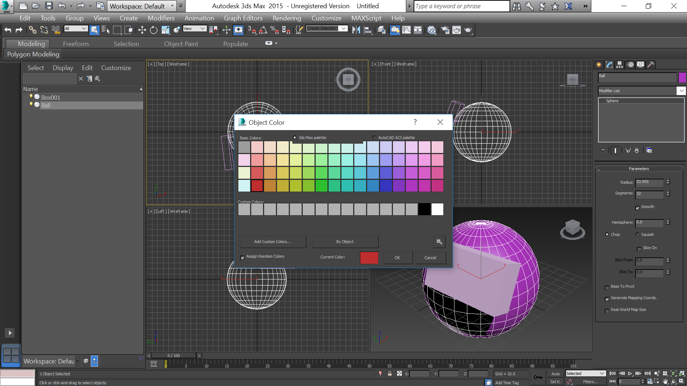

- title : Начало работы в 3ds Max
- description : Практическое задание №2
- author : Василий Пурчел
- theme : night
- transition : default

***

### Отчет 2 

[Начало работы в 3ds Max](http://dl.sumdu.edu.ua/study_tools/drop/start/376586)

Выполнил : Василий Пурчел

Вариант : 6

***

Создаем сферу

***

Добавляем параллелепипед

***

Создаем цилиндр 

***

Создаем второй цилиндр 

***

Модифицируем выбранный объект 

***

Autogrid 

***

Параллелепипед на сфере 

***

Меняем имя и цвет

***

Сохраняем с инициалами

