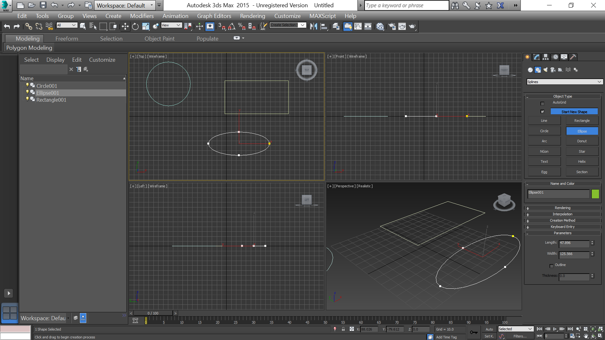
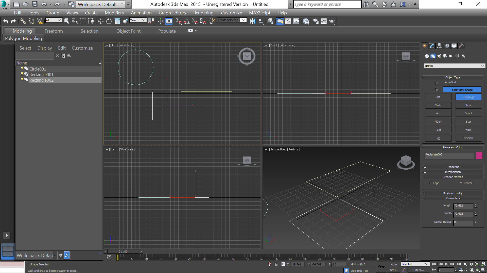
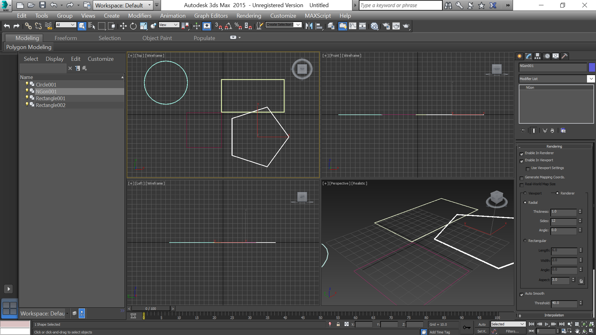
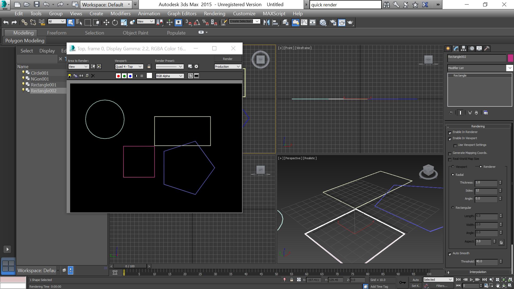
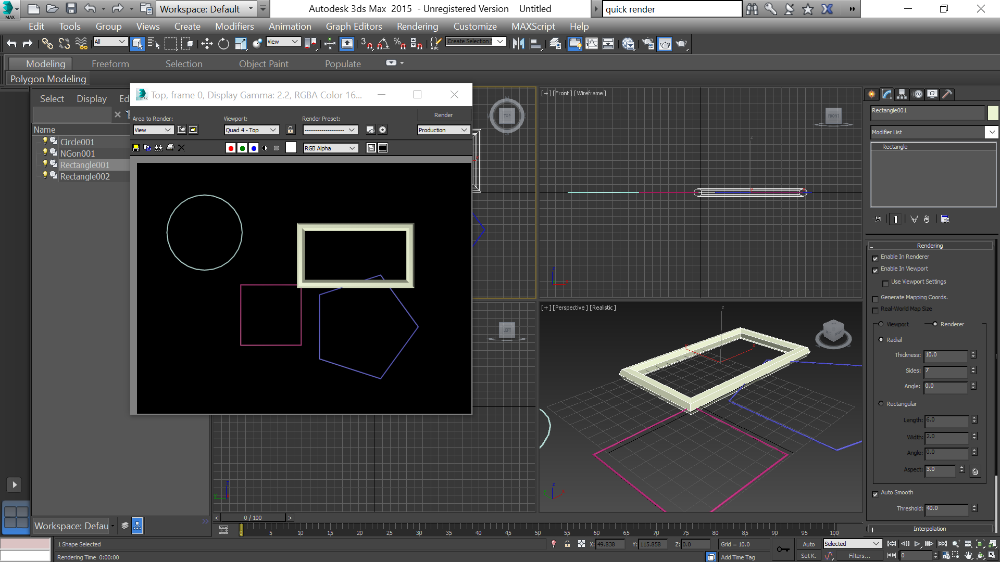
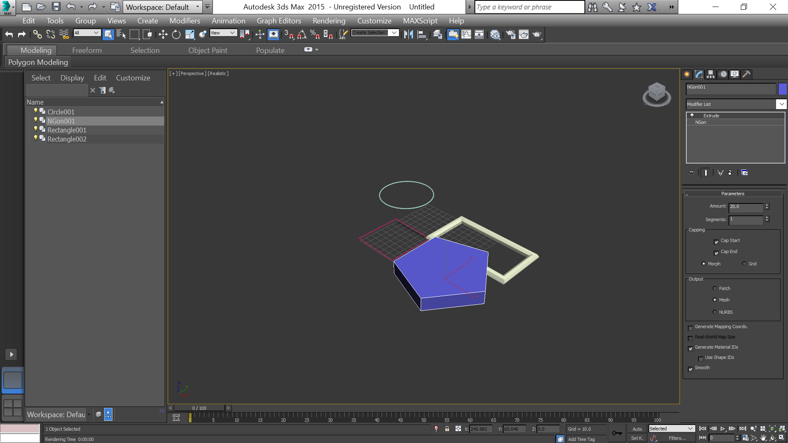
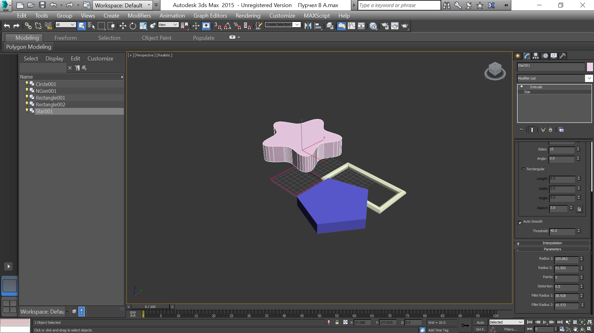

- title : Начало работы в 3ds Max
- description : Основные операции с объектами
- author : Василий Пурчел
- theme : night
- transition : default

***

# Отчет 3

[Основные операции с объектами](http://dl.sumdu.edu.ua/study_tools/drop/start/376595)

Выполнил : Василий Пурчел

Вариант : 6

***

Рисуем круг, прямоугольник и элипс

***

Рисуем квадрат

***

Рисуем многоугольник с 5 сторонами

***

Включаем отрисовку нарисованных фигур

***

Визуализация

***

Визуализация модифицированного прямоугольника

***

Модификатор "Extrude"

***

Создание звезды

