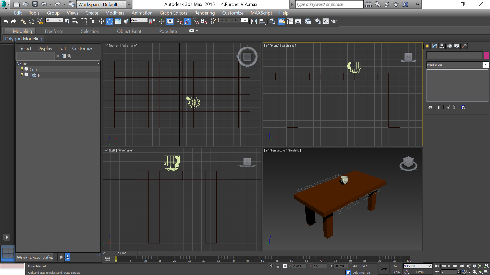
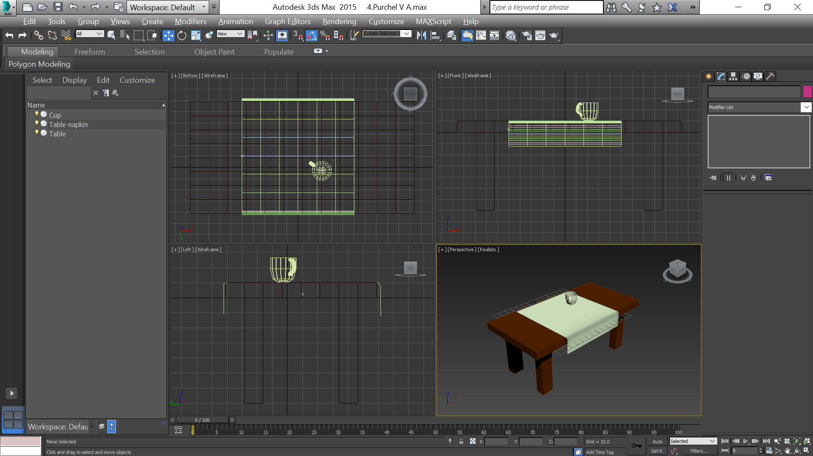
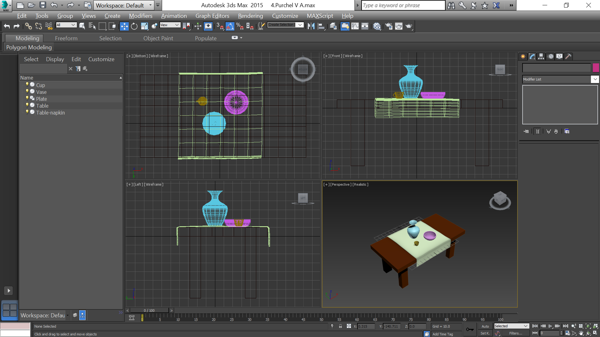
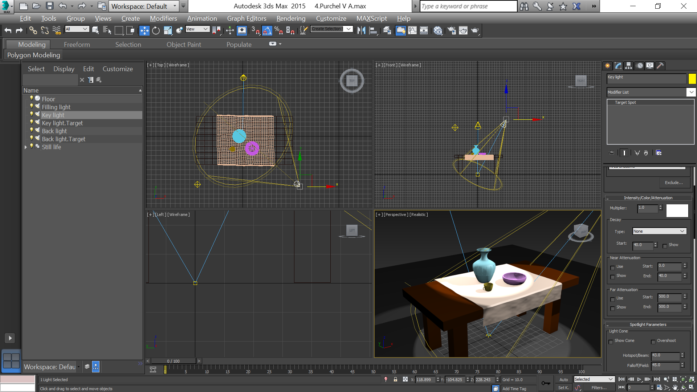
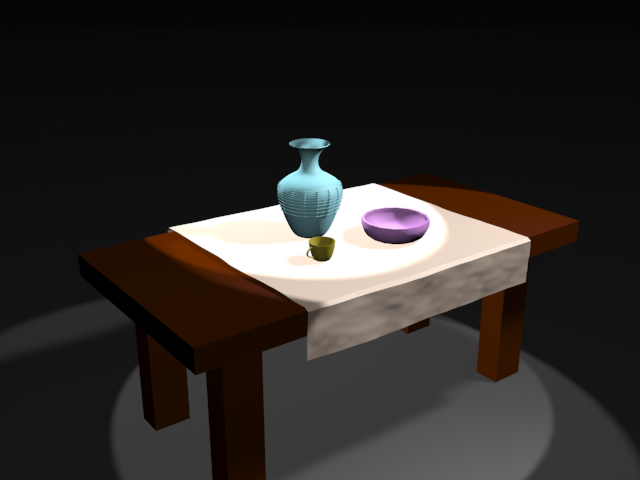

- title : Моделирование с использованием модификаторов
- description : Моделирование с использованием модификаторов
- author : Василий Пурчел
- theme : night
- transition : default

***

### Отчет 4

[Mоделирование с использованием модификаторов](http://dl.sumdu.edu.ua/study_tools/drop/start/376606)

Выполнил : Василий Пурчел

Вариант : 6

Сцена : [4.Purchel V A.max](files/4.Purchel V A.max)

---

### Задание:

**Основное:**

Моделирование стола, салфетки и чашка, модификаторы Lathe, Bevel, Bevel Profile

**Вариант:**

Ваза, тарелка + модификаторы (Noise, Sweep, Stretch, Lattice).

***

### Моделирование

---

Стол из параллелепипеда с выдавленными 4 полигонами для ножек.

---

Чашка:
 - линия со spline outline 0.2 для объема (контур чашки) + Lathe
 - элипс и линия формы ручки + Loft

---

Салфетка (скатерть): лучше результат был бы использовав ткань вместо создания из примитивов с модификаторами
С примитивами Noise дает некоторую реалистичность

---

Ваза и тарелка с помощью линий + Lathe, и Lattice для украшения вазы

***

### Натюрморт

***

### Свет

***

### Визуализация

