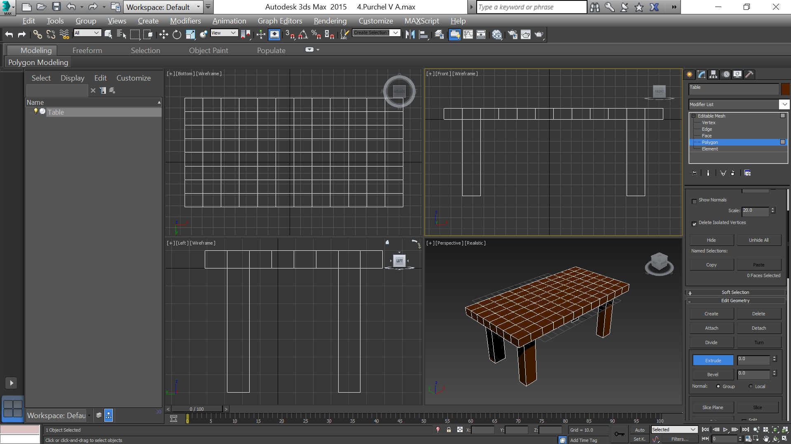

- title : Моделирование с использованием модификаторов
- description : Моделирование с использованием модификаторов
- author : Василий Пурчел
- theme : night
- transition : default

***

### Отчет 4

[Mоделирование с использованием модификаторов](http://dl.sumdu.edu.ua/study_tools/drop/start/376606)

Выполнил : Василий Пурчел

Вариант : 6

---

### Задание:

**Основное:**

Моделирование стола, салфетки и чашка, модификаторы Lathe, Bevel, Bevel Profile

**Вариант:**

Ваза, тарелка + модификаторы (Noise, Sweep, Stretch, Lattice).

***

# Моделирование

---

Стол из параллелепипеда с выдавленными 4 полигонами для ножек.

' Mодель стола с помощью сплайна и модификатора Lathe.

***

# Натюрморт

***

# Свет

***

# Визуализация

