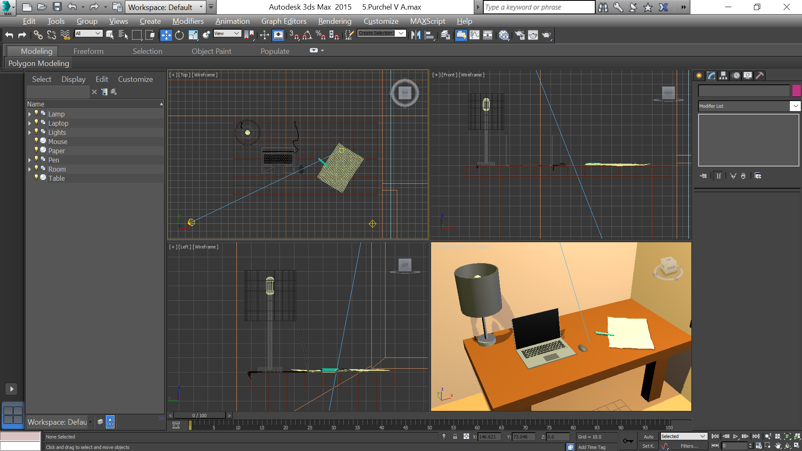
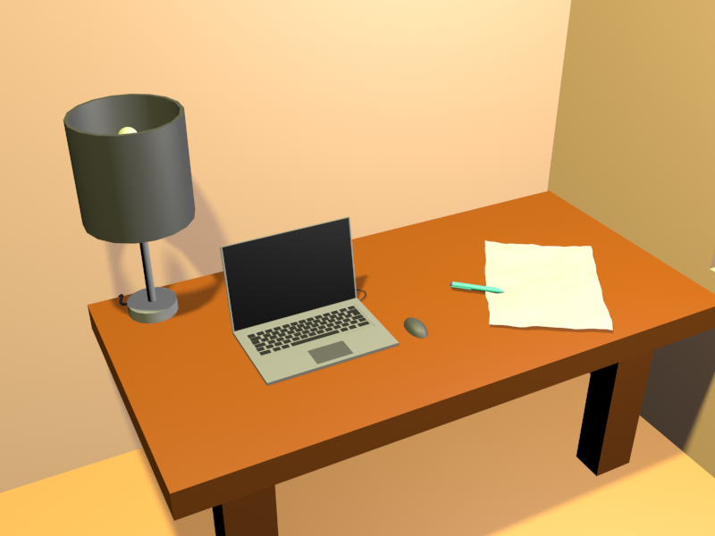

- title : Полигональное моделирование
- description : Совместная работа №1 к теме 6
- author : Василий Пурчел
- theme : night
- transition : default

***

### Полигональное моделирование

[Совместная работа №1 к теме 6](http://dl.sumdu.edu.ua/study_tools/wiki/start/376623)

Выполнил : Василий Пурчел

Вариант : 6

Сцена : [5.Purchel V A.max](files/5.Purchel V A.max)

---

Рабочий стол с ноутбуком, мышкой, лампой, листом и ручкой.

---

Rendered room

