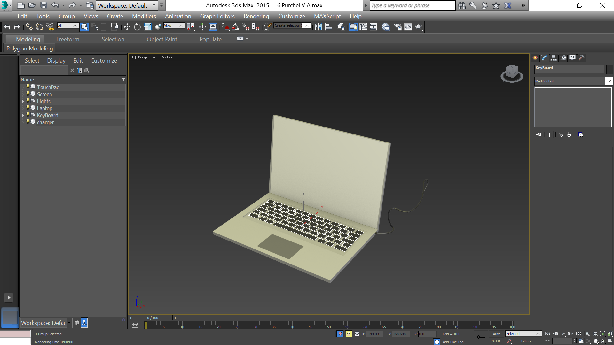
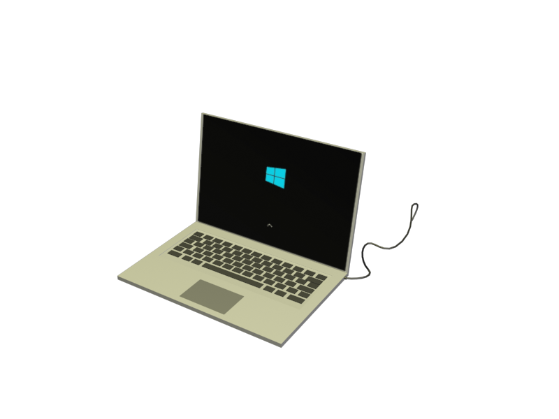

- title : Полигональное моделирование
- description : Совместная работа №2 к теме 6
- author : Василий Пурчел
- theme : night
- transition : default

***

### Полигональное моделирование

[Совместная работа №2 к теме 6](http://dl.sumdu.edu.ua/study_tools/wiki/start/376624)

Выполнил : Василий Пурчел

Вариант : 6

Сцена : [6.Purchel V A.max](files/6.Purchel V A.max)

---

Hоутбук.

---

Rendered

