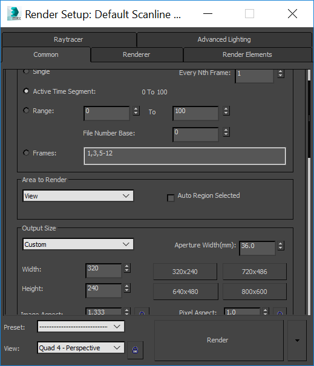

- title : Моделирование с использованием булевых операций
- description : Практическое задание к теме "Моделирование с использованием булевых операци"
- author : Василий Пурчел
- theme : night
- transition : default

***

### Моделирование с использованием булевых операций

[Практическое задание к теме 7](http://dl.sumdu.edu.ua/study_tools/drop/start/376633)

Выполнил : Василий Пурчел

Вариант : 6

Сцена : [7.Purchel V A.max](files/7.Purchel V A.max)

---

### Задание

Создать несколько объектов, добавить к ним материалы, добавить анимацию и визуализировать ее.

***

### Процесс

Поскольку у меня версия 2015 упрощенная, то библиотеки стандартных материалов требуемой заданием нету, потому я воспользовался
созданием материалов в Slate Material Editor

---

Созданные материалы

---

После присвоения материалов объекты становятся белыми, но материалы видно после визуализации:

---

Результат визуализации в размере 320Х240:

---

После добавления простой анимации настраиваем отрисовку:

---

Даже в 320Х240 разрешении визуализация всех кадров занимает некоторое время,
и приходится наблюдать следующее:

***

Results:

 * [tga](files/3dGeom-t6s2.png)
 * [avi](files/animation.avi)

