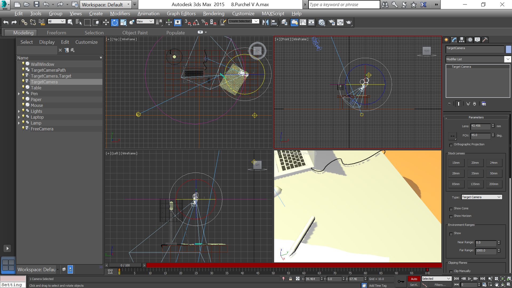
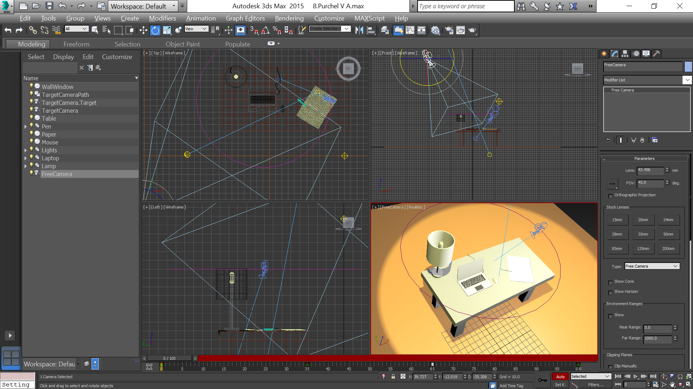
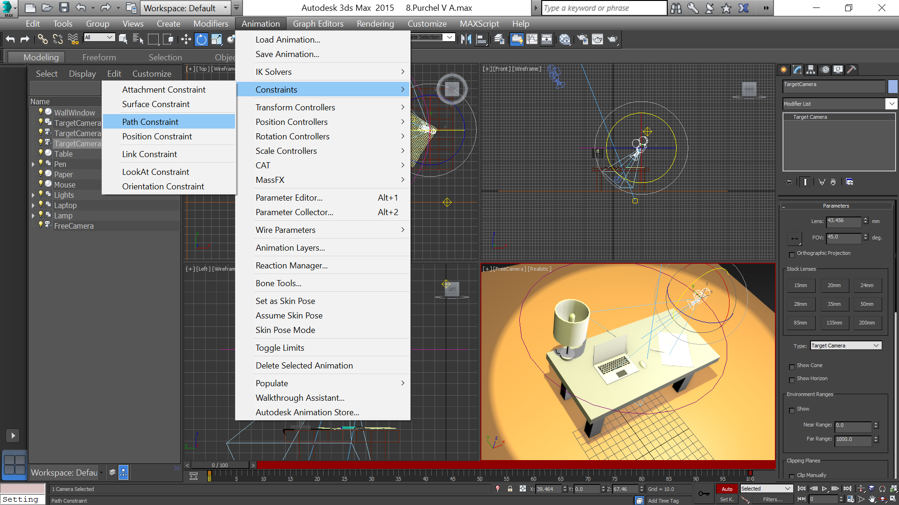
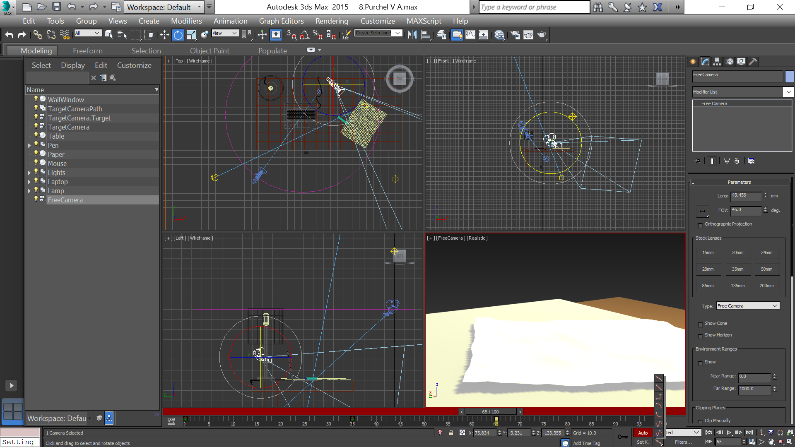

- title : Создание трехмерной анимации
- description : Практическое задание к теме "Создание трехмерной анимации"
- author : Василий Пурчел
- theme : night
- transition : default

***

### Создание трехмерной анимации

[Практическое задание к теме 8](http://dl.sumdu.edu.ua/study_tools/drop/start/376644)

Выполнил : Василий Пурчел

Вариант : 6

Сцена : [8.Purchel V A.max](files/8.Purchel V A.max)

---

### Задание

Создать две камеры - свободную и направленную, анимировать их движение и отрендерить результат.

***

### Процесс

Направленная камера

---

Свободная камера

---

Движение камеры по "пути" устанавливается из меню анимация:

---

Движения свободной камеры задаем с помощью ключевых кадров:

***

Results:

 * [free-camera.avi](files/animation-2.avi)
 * [target-camera.avi](files/animation-3.avi)

---

Свободная камера:

---

Направленная камера:

