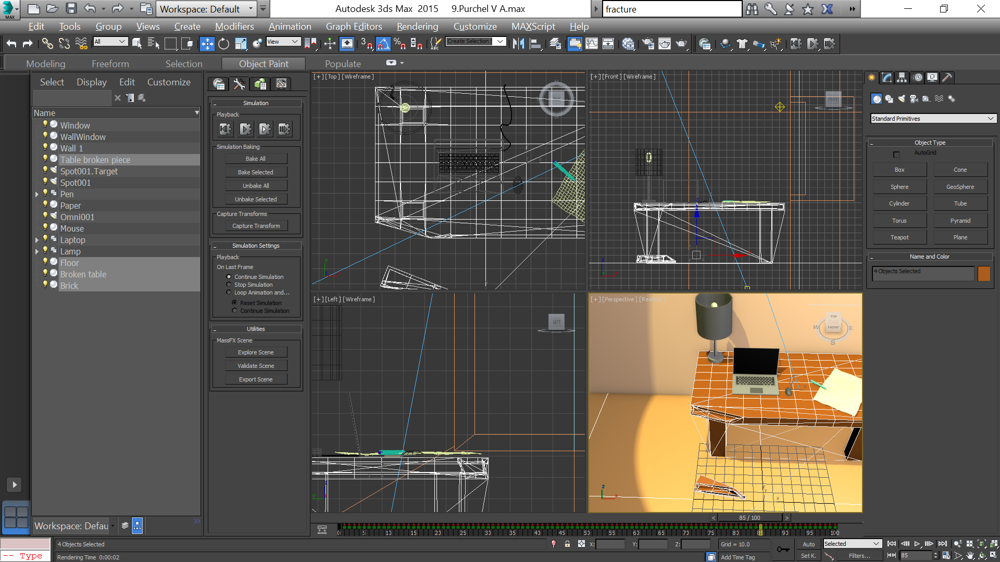
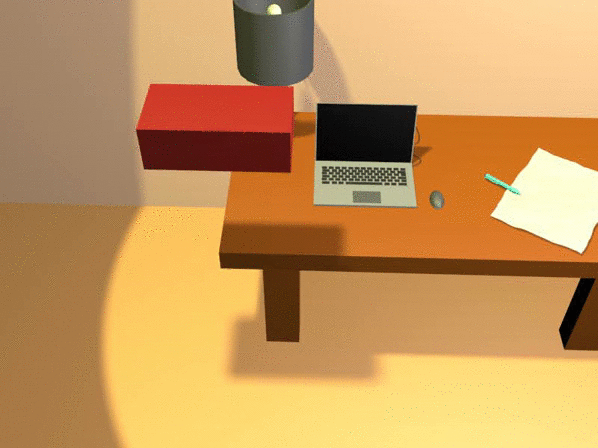

- title : Имитация динамических взаимодействий в 3ds Max
- description : Совместное задание к теме "Имитация динамических взаимодействий в 3ds Max"
- author : Василий Пурчел
- theme : night
- transition : default

***

### Имитация динамических взаимодействий в 3ds Max

[Совместное задание к теме 9](http://dl.sumdu.edu.ua/study_tools/wiki/start/376653)

Выполнил : Василий Пурчел

Вариант : 6

Сцена : [9.Purchel V A.max](files/9.Purchel V A.max)

---

### Задание

 * Откройте сцену, которую вы создали при выполнении задания для совместной работы к теме №6 "Полигональное моделирование".
 * Смоделируйте тяжелый брусок, который падает на любой объект вашей сцены и отбивает его часть.
 * Сохраните сцену с именем "Ваша фамилия на английском языке_тема 9" в формате .max 
 * Выложите изображение в виде скриншота в среде 3dsMax (при этом строка-заголовок содержит вашу фамилию).

***

### Сцена

***

Results:

 * [animation.avi](files/animation-4.avi)

---

